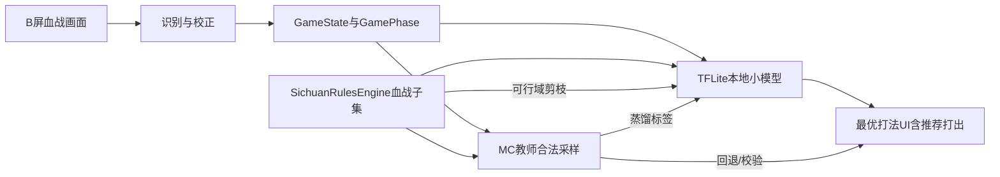

# 四川麻将记牌器计划（修订版）

## 与旧版计划的关系

- 工作区已非空：核心骨架与部分能力已在 [f:\AI\majiang](f:\AI\majiang) 落地（参见 [README.md](f:\AI\majiang\README.md)、[`GameViewModel`](f:\AI\majiang\app\src\main\java\com\majiang\counter\ui\GameViewModel.kt)、[`SituationAnalyzer`](f:\AI\majiang\app\src\main\java\com\majiang\counter\analysis\SituationAnalyzer.kt) 等）。
- 本修订版吸收上一轮质疑与你的 10 条反馈：**产品目标收窄**、**可观测信息定义改写**、**蒸馏必做**、**性能阶段后置**、**文档与指标对齐**。

## 产品目标（唯一）

- **唯一目的**：在「贴合 **四川麻将血战到底**（及常见房规变体）」的前提下，为用户提供 **最优打法辅助**：综合 **游戏画面还原的公开状态**、**血战规则可判定性**、**端侧小规模本地模型（TFLite）** 与 **MC 教师**，在信息不完备处给出可解释的打牌建议（听牌/打出风险等面板均服务于该目的）。
- **「最优」分阶段表述（避免用户预期错位）**：
  - **v1（本计划优先闭环）**：在规则可行域内，优化 **进张效率 / 听牌质量 / 点炮与点杠风险** 等牌张维度指标；UI 文案可称 **「打法建议」** 或 **「v1：进张与防守」**，与数学上的「全局最优」区分。
  - **v2**：接入 **`ScoringConfig`（番种、封顶、血战计分）** 后，再在相同 MC/TFLite 框架下扩展为 **期望得分最大化** 的推荐。
- **合规表述（刻意模糊、短句）**：本工具面向 **个人练习**；不围绕赌博场景展开功能与文案。仍保留极简「使用自负」式提示即可，不展开长篇合规章节。

## 「工程矛盾」是什么（通俗版）

- **矛盾点**：开发早期 `TileClassifier` 往往是**占位假识别**（例如固定返回某张牌）。若仍把它当成「真对局」写进 [`GameState`](f:\AI\majiang\app\src\main\java\com\majiang\counter\domain\GameState.kt)，后面的「最优打法」分析会在**错误牌河**上算得很认真——看起来像跑通了，其实是**垃圾进、垃圾出**。
- **对策（写进实现约束）**：
  - **门禁写入**：仅当稳定帧 + 置信度阈值满足时，才把 `DiscardEvent` 写入正式 `GameState`。
  - **开发/演示**：用 **模拟牌局事件注入** 或 Debug 开关验证管线，与「真实识别写入」分流。
  - 计划正文删除「空项目从零」表述，改为**当前进度 + 剩余里程碑**（与 YAML todos 一致）。

## 可观测信息：以游戏画面为准（替代「猜」叙事）

- **原则**：凡目标麻将 App **在 B 屏上展示**的信息（本家手牌、四家牌河、定缺标识、明碰/明杠/部分游戏对暗杠的 UI 表达等），均作为 **可观测状态**，通过 **识别 + 低摩擦校正** 进入领域模型；**不在产品层强调「猜三家暗手」**。
- **边界（避免逻辑自相矛盾）**：对「该款游戏 UI 根本不显示」的信息（若存在），在皮肤包/字段清单里标注为 **不可从画面获得**；MC 仅对**规则允许且仍为未知**的部分做「合法随机完成」，并在 UI 用**非数学化**一句话说明「剩余未知部分按规则合法补齐」。
- **领域模型影响**：在 `GameState` / `AnalysisContext` 中显式纳入 **定缺（按座位）**、**明示副露** 等扩展字段（与 [`SichuanRulesEngine`](f:\AI\majiang\app\src\main\java\com\majiang\counter\rules\SichuanRulesEngine.kt) 子集同步演进）。

## 四川麻将血战到底：规则锚定（检索摘要 + 实现策略）

以下综合公开资料中与「血战到底」 commonly 一致的描述（**各地房规仍有差异**，实现侧一律 **`RulesConfig` 开关化**，避免写死一套民间口径）：

- **牌具**：通常仅 **万/条/筒** 三门，共 **108 张**（无风、无字、无花）。参见 [百度百科：四川麻将](https://baike.baidu.com/item/%E5%9B%9B%E5%B7%9D%E9%BA%BB%E5%B0%86/1287910) 等综述。
- **定缺（缺一门）**：胡牌前须 **打缺一门**，手牌仅能保留两门花色与缺门无关的组合；与本 App 画面上的 **万/条/筒定缺标识** 对齐（已在 `picture/` 结论中覆盖）。
- **无吃**：**不可吃牌**，仅 **碰、杠**（与前一版计划一致）；规则引擎不建模「吃」。
- **血战到底**：**一家胡牌不终局**，未胡玩家继续，直至 **三家胡** 或 **流局**（具体终局条件以目标房规为准）；`GameState` 须维护 **存活玩家集**、**已胡玩家**（若画面或分数区可推断），供 MC 采样与点炮分析一致使用；单测单列为 **§血战状态机验收**。
- **一炮多响（四川麻将既定规则，本计划默认实现）**：**多家可同时和同一炮张**；`SichuanRulesEngine` 在判定「打出 `d` 后点炮」时仍须返回 **和牌家集合**（可能多于 1 家），供调试、v2 计分与内部一致性校验。**计分、下局庄家** 等桌规归 **v2 `ScoringConfig`**。**v1 固定口径**：对外指标 **`RonAny(d)`** 与 MC 频率估计一律定义为 **「∃ 至少一家能和」**（存在性：和牌家集合非空），**不**采用「和牌家数期望」等多值标量；若 v2 需要后者，另起字段名（如 `RonCountExpected`）避免与 v1 混用。
- **杠（刮风下雨）**：明杠/暗杠等在不同平台计分不同；**规则引擎 v1** 以保证 **合法性判定 + 是否可杠** 为主，**分数期望**后置。
- **流局相关**：民间常提 **查花猪、查大叫**、**牌墙最后若干张必胡** 等（参见 [游戏茶苑等问答整理](http://www.gametea.com/ask/201701/4753.html)）；是否纳入 v1 由 `RulesConfig` 决定，**默认保守**：未在画面与规则双方确认前不启用，避免与真实 App 房规冲突。

**实现要点**：将上述条目映射为 `RulesConfig` / `SichuanRulesEngine` 的**显式分支**；**一炮多响默认 `true`**，仅在为兼容极少数房规时允许关闭。单元测试须覆盖 **牌例 + 边界**（定缺违反、血战存活变化、**一炮多响多家同时和**、碰杠胡优先级），并在 README 标明「当前子集包含/不包含哪些房规」。

## 最优打法：游戏画面 + 血战规则 + 小规模本地模型

**目标定义（产品可解释）**：在「画面已解析的公开信息」+「血战到底规则子集」下，对每个本家决策点给出 **排序或主推荐**（例如：优先打出哪张、听哪门进张更稳），并在 UI 用**牌语**说明依据（听张、铳张风险、定缺约束等）；**不宣称**读取游戏服务器或对手真实意图。对外文案与 **§产品目标** 中 v1/v2 分阶段表述一致。

**三层分工（全部在 A 机本地运行）**：

1. **画面 → 状态**：CameraX + ROI + 分类/OCR → 维护 `GameState`（河、副露、定缺、手牌、`GamePhase`、HUD 对账等）；见上文 `picture/` 规格。
2. **规则 → 可行域**：`SichuanRulesEngine` 给出 **合法打出集合**、**听牌集合**、**碰杠胡可应性**；任何模型输出 **不得** 违反可行域（硬约束）。
3. **小规模本地模型 → 排序/期望**：在可行域内，用 **端侧 TFLite 小网络**（输入为 **低维离散特征向量**：各牌剩余计数、定缺 one-hot、副露编码、巡目、是否多家存活等，**不必**上大模型 API）近似 MC 教师的 **进张概率 / 点炮风险 / 综合打分**；MC 离线或低频在线生成教师标签，**蒸馏**到 TFLite；推理时 **TFLite 默认、MC 回退**，与既有计划一致。

**与「纯 MC」关系**：小模型不是替代规则，而是 **在相同规则与先验下压缩 MC 结果**，加快「最优打法」反馈；教师标签必须在 **血战规则合法** 的采样上生成，避免蒸馏学偏。

## 基于麻将 APP 截图的画面信息规格（`picture/` 为真值来源）

你已确认将截图放入仓库 **[f:\AI\majiang\picture](f:\AI\majiang\picture)**（或同名子目录）。在像素级参数落地前，**以这些全屏截图为唯一依据**做「画面里有什么 → 领域模型填什么」的逆向规格，避免凭想象补 ROI。

### 首款目标 App 截图结论（当前 `picture/` PNG 抽样，已读图）

以下依据对多张截图（含序列首帧 **换三张**、中段 **碰** 响应、末段 **正常对局+胡提示**）的界面内容归纳，用于锁定 **皮肤包 `appId` 初值** 与 **GameState 扩展字段**，不等同于已完成像素级 ROI 标定。

- **游戏与布局**：画面中央标识 **「血战麻将」**；**横屏**；**本家永远在屏幕下方**；对家在上、左右为两侧玩家（与计划「本家在下为正常画面」一致）。
- **建议 `appId`**：`xuezhan_mahjong_default`（若后续取得安装包名再替换为正式 id，仅改皮肤包配置）。
- **定缺（四家均可从画面读）**：各玩家头像旁有 **彩色小方块 +「万/条/筒」文字**（例如红底万、绿底条、紫底筒），四家均展示 → 对应计划表 `dingque_*`；识别路径宜 **模板/颜色分类 + 轻量 OCR** 双保险。
- **庄家**：头像侧 **「庄」** 标 → 领域层增加 `dealerSeat`（或与 `Seat` 枚举绑定），供规则子集使用。
- **HUD（建议 OCR + 与记牌交叉校验）**：桌面中央区域可见 **「剩 NN 张」**、**「第 x/y 局」**；中央圆盘为 **倒计时秒数** → 映射 `remainingDeckHud`、`roundProgressLabel`；与「河+副露+手牌」张数守恒对账，降低识别漏牌风险。
- **本家手牌区 `hand_bottom`**：底部横向排列，常见 **13 或 14 张**（摸牌待打）；**换三张**阶段会出现 **右侧单独挑出 3 张** 的视觉分组，并配合文案 **「等待其他玩家选牌」**、他家 **「已选牌」** → 需 **`GamePhase`：换三张 / 对局中 / 碰杠响应** 等**，此阶段 **不得** 把「挑出的 3 张」误计为已打出河牌。
- **对手「暗手」在画面上的可观测形式**：对手持牌为 **背面叠牌**，但 UI 给出 **剩余张数**（如 10、13）→ 非牌面，但 **张数约束** 可进 `GameState`（用于校验与 MC 边界）；与此前「不靠猜」叙事一致：**能见的都进模型**。
- **牌河 `river_*`**：各家弃牌主要出现在 **该家座位前方的牌河格**；部分帧在 **桌面中央** 会出现与 **碰/杠/胡** 提示相关的 **最近打出牌** 展示（四川血战 **无「吃」**），需与四边牌河做 **去重/主从关系**（避免同一弃牌被两个 ROI 计两次）。
- **明副露 `meld_*`**：明刻/明杠以 **纵向牌组** 出现在左/上/右玩家侧（截图中有杠、碰多组并存）；本家也有 **横向副露**（如刻子）→ 每家副露独立 ROI 或「半边桌」分割，更新频率低于牌河。
- **操作提示与规则引擎对齐**：画面可出现大号 **「碰」**、浮层 **「胡」** 等 → 对应 **碰杠响应窗口**（四川血战 **无「吃」**）；`SichuanRulesEngine` 与记牌管线需共享「**上一打出牌归属座位**」，与 MC 中动作优先级一致。
- **其他 UI**：左上 **房号**、网络 **延迟 ms**、右侧 **设置/记谱/提示灯泡** 等，与牌张逻辑弱相关，可不进核心 `GameState`，至多记入 Debug。

### 素材与命名（建议）

- **格式**：PNG 或 JPG，尽量无损、关闭隐私水印遮挡牌面。
- **覆盖场景（每类至少 1 张，多多益善）**：
  - **基准布局**：对局中「静止」帧，四家牌河清晰、本家手牌展开（13 或 14 张）。
  - **定缺**：定缺选择界面或头像旁已显示缺门的对局帧。
  - **副露**：至少一张含 **明碰 / 明杠 / 补杠** 的桌面布局（用于副露区 ROI 与牌列方向）。
  - **时间序列**：同一巡 **出牌动画前 / 动画后** 各一帧（用于稳定帧状态机参数）。
  - **血战阶段**：有人已胡、牌局继续时的画面（若 UI 有离场/换座提示一并截取）。
  - **HUD**：若画面显示 **剩余张数、局数、当前出牌者** 等，单独截清晰帧（决定是否需要轻量 OCR 与交叉校验）。

### 画面分解（从截图上必须标出的 UI 区域）

对每张截图在图外维护一份标注说明（可用任意画图工具框选 + 记录归一化坐标，后续写入 `AppProfile`）：

| 区域 ID | 典型内容 | 产出数据 |
|----------|----------|----------|
| `river_bottom` / `river_right` / `river_top` / `river_left` | 四家弃牌序列 | 每位 `Seat` 的弃牌列表与时间顺序；与「本家在下」几何一致 |
| `hand_bottom` | 本家手牌 | 当前手牌 multiset；13/14 张；换三张时右侧 3 张选中分组 |
| `hand_count_left` / `hand_count_top` / `hand_count_right` | 对手背面牌叠 + 张数 UI | 各家持牌 **张数**（非牌面），用于守恒校验与展示 |
| `melds_all` 或按边 `meld_*` | 明碰、明杠等（四川血战 **无「吃」**） | 每家副露牌组 + 类型（碰/直杠/弯杠等以规则子集为准） |
| `dingque_*` | 头像旁彩色块 +「万/条/筒」 | 每家 `定缺`：万/条/筒（本款游戏已证实四家均显示） |
| `dealer_badge` | 「庄」标 | 庄家座位 `dealerSeat` |
| `hud` | 「剩 NN 张」「第 x/y 局」、倒计时 | **推荐 OCR**；与记牌器张数守恒交叉校验 |
| `wall_or_deck` | 若游戏画出牌墙或牌墩 | 通常仅装饰；是否参与识别以截图为准 |

若某区域在该 App **不存在或不可读**，在映射表中显式标为 **N/A**，避免实现阶段假设。

### 「最优打法」所需完备信息清单（从画面应能还原或校验）

以下集合为 **MC / 规则** 的最小输入闭包；**优先从画面识别或半自动填入**，仅对截图与规则共同确认「永不可见」的项保留 MC 合法补齐（并在 UI 一句话说明）：

1. **牌组模式**：如 108 张血战（无字）；若 App 支持变体，以设置或画面标识为准。
2. **四家弃牌序列**：完整 multiset + 顺序（用于碰杠点炮等上下文；四川血战 **无「吃」**）。
3. **本家手牌**：13/14 张内容及是否已摸待打（决定听牌枚举与打出候选）。
4. **每家定缺**：与四川玩法相关的约束输入。
5. **每家明副露**：牌面与副露类型（与 `SichuanRulesEngine` 子集一致）。
6. **当前行动语境**：本款已证实可通过 **阶段文案 + 中央操作按钮（碰/胡等）+ 手牌张数（13/14）+ 换三张布局** 推断；领域层显式建模 `GamePhase`（对局中 / 换三张 / 碰杠响应 / …），各视觉模块在 `phase != 对局中` 时降级或关闭牌河差分。
7. **全局已现张数约束**：由河+副露+本家手牌+（若画面有明示）共同计数，校验与 HUD「剩余」可选对账。

### 工程产出物（截图入库后的固定交付）

1. **《画面字段 → GameState 映射表》**（Markdown 或同仓库文档）：每行包含 UI 元素描述、`GameState` 字段路径、`AppProfile` ROI id、识别方式（差分 / 整列 OCR / 牌面分类）、**失败时人工校正入口**。
2. **更新 [`AppProfile`](f:\AI\majiang\app\src\main\java\com\majiang\counter\profile\AppProfile.kt)**：在占位 `appId` 上增加多 ROI、可选 OCR 区域、稳定帧建议值（由动画前后帧测得）。
3. **皮肤包资源清单**：从截图裁切的单牌模板尺寸、是否需单独「背面/盖牌」模板、定缺图标模板等。

### 与视觉管线的衔接

- **四牌河差分**仍是主路径；**副露区、定缺区**可能需 **额外 ROI + 低频刷新**（副露变化频率低于弃牌）。
- **本家手牌**：若该 App 始终完整展示，可优先 **整带 OCR/分类** 辅助，减少纯手录；仍以用户一键确认为准，避免误识别污染「最优打法」。
- 截图分析完成后，再锁定 **TileClassifier** 训练集与 **蒸馏特征** 是否加入「副露编码向量」「定缺 one-hot」等离散字段。

## 风险与验收标准（可行性治理）

### 视觉与状态同步

- **验收指标（首款 `appId` 上可调阈值，写入皮肤包或远程默认）**：
  - **弃牌序列**：在标注金帧或录屏真值上，约定 **单张误检率、漏检率** 上限（具体百分比在首款标定完成后写入 `AppProfile` 或皮肤包元数据，作为是否允许自动写入河牌的门槛）。
  - **HUD「剩 NN 张」OCR**：与「河 + 副露 + 各手牌张数 + 本家明手」守恒式对账；**连续 K 次对账失败**（建议 K=2～3）则：**降级为仅手动记牌 + 弹窗提示识别不可靠**，禁止自动写入 `GameState` 的河牌增量直至用户确认或重标定。
- **金帧回归（推荐）**：从 `picture/` 或录屏截取 **固定若干帧**（换三张、碰杠窗、普通巡、一炮多响局面若可构造）作为 CI/本地脚本的 **视觉回归集**，防止 ROI 或阈值改动导致大面积退化。

### 血战状态机验收

- **单测必含**：已胡玩家不再参与摸打（或按规则参与结算后离场）、剩余存活家集合变化、流局条件与 **一炮多响** 同一打出对应多家 `Ron` 集合；与 `GamePhase`、画面推断一致。

### 蒸馏与模型治理

- **版本绑定**：每次发布 TFLite 须记录 **`modelVersion` + `appId` + `rulesHash`（`RulesConfig` 序列化哈希）+ `featureSchemaVersion`**；任一变更默认视为需 **重训或至少重标定 MC 教师批次**。
- **教师数据版本化**：MC 生成的 `(特征, 标签)` 数据集按 **日期/规则版本** 分目录存储（仓库外可放 `docs/ml/` 或独立仓，但须在 README 说明路径约定）。
- **TFLite 回退到 MC 的触发条件（实现时写死逻辑）**：例如 **特征缺字段**、**推理 NaN/越界**、**与 MC 抽检偏差超过阈值**（离线标定）、**用户开启「仅 MC」调试** —— 满足任一即走 MC 路径并在 UI 轻提示。
- **产物位置**：例如 `app/src/main/assets/ml/{appId}/policy-v{modelVersion}.tflite`；Gradle 打包校验文件存在性与版本元数据 `assets/ml/model_manifest.json`。

## 计算方法：规则优先、对用户少讲公式

- **L0 规则引擎**：听/胡/点炮/杠（子集内）一律走 `SichuanRulesEngine`，保证与四川玩法一致的可判定性；单元测试以**牌例**为主，少写抽象概率证明。**四川血战本子集不包含「吃」**：不实现吃牌判定，不与「吃」相关 UI 做规则绑定（若他款地方麻将误显示「吃」按钮，视为非本计划范围）。
- **L1 MC**：在「已锁定画面可观测信息 + 规则约束」下，对仍未知部分做蒙特卡洛；指标定义用**牌手能理解的牌语**在 UI 呈现，技术文档再用公式对齐。
- **指标与「最优打法」对齐（需在实现里收口，避免歧义）**：
  - **听牌**：枚举听牌集合；每张听牌张的「价值/概率」在 v1 与计划中的 **MC 定义**对齐（替换 README 中「剩余/剩余总数」的临时简化，见下文文档任务）。
  - **打出**：对候选打出 `d`，在 **一炮多响默认开启** 下，规则引擎内部返回 **能和的家集合**（可多于 1 家）；**v1 固定**：`RonAny(d)` 与 MC 须一致为 **「∃ 至少一家能和」** 的概率或频率估计（集合非空），**不**使用「和牌家数期望」作为 `RonAny` 语义。**杠** 判定与 **胡优先于碰杠** 等与 MC 共用同一套动作顺序；**四川血战子集不含「吃」**。

## 模型蒸馏与端侧小模型（必交付；即「小规模本地模型」）

- **必做**：在 **血战到底规则 + 画面解析状态** 约束下，由 **L1 MC** 生成教师标签 `(特征向量 → 听牌侧标签 / 打出侧标签)`，离线训练 **小型 TFLite**（参数量保持手机可承受范围），作为 **默认推理路径**；MC 作为 **校验 / 回退 / 继续生成训练数据**。
- **训练管线（仓库约定）**：离线训练使用 **Python + TensorFlow/Keras 或 tflite_support** 等，脚本建议放在 **`tools/ml/`**（或独立子模块仓库，须在 README 说明）；产出 **`policy_*.tflite` + `model_manifest.json`** 拷入 `assets/ml/`；CI 可选：**manifest 与二进制同步校验**。
- **特征设计**：以 **规则对齐的离散特征** 为主（张数向量、定缺、副露结构、阶段 one-hot、是否多家仍存活等），便于蒸馏稳定、可解释；是否叠加少量 **牌面裁剪的轻量嵌入** 由首款 `AppProfile` 决定，**不依赖**云端大模型。
- **输出形态（服务「最优打法」）**：在「我的听牌」「我的手牌」之上，增加或归并为 **「推荐打出」排序条 / 主选一张**（由 TFLite 或 MC 回退给出），且 **被规则引擎标为非法的候选不出现在推荐里**。
- **治理**：见 **§风险与验收标准 → 蒸馏与模型治理**。
- **后置**：INT8、批大小、并行化等性能专项仍后置，不阻塞「规则 + MC + TFLite」闭环。

## 相机与交互（你补充的 UX）

- **固定提示文案**：引导用户将 A 机摄像头 **对准 B 机游戏画面**；约定 **本家视角在最下方为正常画面**，ROI 座位映射与「我的座位」默认对齐该约定（仍保留一次性标定与纠错入口）。

## 与代码/文档的对齐任务（落实你同意的第 9、10 点）

- **更新** [.cursor/plans/四川麻将记牌器_app_46412d8d.plan.md](f:\AI\majiang\.cursor\plans\四川麻将记牌器_app_46412d8d.plan.md) 正文：背景、可观测、L2 必做、性能阶段、产品目标、工程矛盾说明、进度表述。
- **更新** [README.md](f:\AI\majiang\README.md)：**分析**章节中「我的听牌」的公式与计划版 **MC 指标**一致；增加「最优打法 / 个人练习」一句话定位；简述蒸馏与占位识别门禁，避免读者误以为简化公式是终态。

## 评审固化检查清单（不写代码；里程碑 / 发版勾选）

说明：由计划评审结论整理，与正文 **§风险与验收标准**、**§蒸馏与模型治理** 互补；勾选表示「已验证或已落实（含文档）」。执行开发时仍不写代码即可完成「文档与评审」侧勾选。

### A. 真值与视觉关键路径

- [ ] `picture/`（或团队约定的等价目录）在仓库内可见且路径固定；截图覆盖 **§素材与命名** 所列场景类（基准、定缺、副露、动画前后帧、血战多阶段、HUD 等），张数与标注责任无争议
- [ ] **逐张像素 ROI 标注**完成，且产出 **《画面字段 → GameState 映射表》**（每行含：UI 描述、`GameState` 字段路径、`AppProfile` ROI id、识别方式、失败时人工校正入口）
- [ ] **中央最近打出**与四边 `river_*` 的 **主从关系 / 去重规则** 已写入映射表，并完成一次走读（避免同一弃牌双计）
- [ ] **`GamePhase`**（换三张 / 对局中 / 碰杠响应等）与视觉管线约定一致：**非对局阶段**不得把「换三张挑出 3 张」等误计为河牌增量（映射表或门禁说明中可引用）

### B. 门禁、对账与回归

- [ ] 自动写入正式 `GameState` 的条件已书面落地：**稳定帧 + 置信度阈值**（初值写入 `AppProfile` 或皮肤包元数据）
- [ ] **HUD 与记牌守恒**对账失败时的 **连续 K 次降级**（建议 K=2～3）策略已写入实现说明，且 **UI 提示文案** 与产品口径一致（禁止自动写河直至用户确认 / 重标定）
- [ ] **金帧或录屏回归集**：已列出帧清单与期望 `GameState`/河牌增量（至少含：普通巡、换三张、碰杠响应窗；若可构造则含一炮多响相关帧）

### C. 规则引擎与指标一致性

- [ ] **当前血战子集**在 README、本计划、代码侧注释（或 `RulesConfig` 说明）三处 **「包含 / 明确不包含」** 的房规列表一致（如查大叫、查花猪、牌墙末张必胡等未启用项已显式标注）
- [ ] **一炮多响**默认开启与 `SichuanRulesEngine` 返回 **和牌家集合**（可多于 1 家）的行为一致，且单测覆盖 **多家同时和** 与存活集变化
- [ ] **`RonAny(d)`** 在规则层、MC 频率估计、`SituationAnalyzer`、README 用户可读说明中为 **同一语义**：**「∃ 至少一家能和」**（集合非空）；若 v2 引入「和牌家数期望」等，已另起字段名且未与 v1 混用

### D. MC、蒸馏与 TFLite 闭环

- [ ] **v1 TFLite 输出范围**已书面收窄（例如首版仅「推荐打出」或仅听牌侧标签），避免首版同时承担全面板导致特征与标签长期漂移
- [ ] **特征 schema 版本**已定稿；`assets/ml/model_manifest.json`（或等价）字段约定已确认：`modelVersion`、`appId`、`rulesHash`、`featureSchemaVersion` 等与打包校验规则一致
- [ ] **MC 最坏局面**在目标机型或约定设备上做过耗时摸底；**MC 回退 / 仅手动记牌** 路径在可接受范围内或已记录豁免与后续 `perf-later` 项
- [ ] **TFLite → MC 回退**触发条件已按 **§蒸馏与模型治理** 列表逐项落实或已记录「暂不实现 + 原因」

### E. 文档与单一事实来源

- [ ] **执行主文档**明确为本文修订版；[四川麻将记牌器_app_46412d8d.plan.md](f:\AI\majiang\.cursor\plans\四川麻将记牌器_app_46412d8d.plan.md) 已同步修订或已加注 **「以修订版为准」** 并消除与修订版矛盾的段落
- [ ] **README**「分析」章节与 **MC 指标、v1「打法建议」文案、占位识别门禁** 已与修订版一致，读者不会将临时简化公式误认为终态

## 建议实现顺序（修订）

**关键路径**：`picture-spec-audit` → `vision-pipeline`（精确 ROI 前视觉自动记牌不可靠）。**可并行**：在手录/模拟 `GameState` 下并行推进 `domain-observables`、`rules-engine-extend`、`mc-teacher-unify`，不阻塞 MC 与规则单测；`distill-tflite` 依赖稳定 **特征模式** 与 MC 教师批次；`acceptance-criteria` 与首款联调收尾绑定。

0. **（初版已完成）** `picture/1.png`–`13.png`（2556×1179）已入库；**《画面字段 → GameState 映射表》** 已补充逐帧场景、**中央弃牌 vs 四河去重** 规则，**`AppProfile.xuezhanDefault()`** 已按读图粗估回填。后续仍以 **相机页标定** 微调像素级 ROI。
1. 扩展 `GameState` / UI：定缺与明示副露（以映射表字段为准，先手动录入也可）。
2. 扩展 `SichuanRulesEngine`：**血战到底**子集（108 张、定缺、无吃、碰杠、一炮多响等 `RulesConfig`）与 `GamePhase`、画面字段一致。
3. 统一 `SituationAnalyzer`：听牌概率与打出风险全部走 **MC（教师）**，标签供 TFLite 蒸馏；单测绑定小规模枚举。
4. **TFLite 小规模本地模型**：血战合法采样上蒸馏；默认推理 + MC 回退；可选 UI **推荐打出**。
5. `AppProfile` + `TableTracker` 真差分链路；分类器替换为皮肤包资源。
6. 最后再集中做性能与量化（对应原 L3）。

## 产品交互（2026-05 修订）

- **主导航**：**对局** + **设置**（不再分记牌 / 分析 / 相机三 Tab）。
- **对局流程**：**打开相机** → 对准牌桌（自动记录舍牌）→ **开始分析**（识别本家 13 张手牌后打法推算）。
- **记牌**：画面驱动（舍牌流式写入 + 分析前手牌快照）；**取消手录**。
- **设置**：画面区域标定、自动识别牌墙剩张开关；主流程不出现 ROI / MC / TFLite 等开发用语。
- **文案**：面向玩家，统一见 `app/.../ui/PlayerStrings.kt`。

